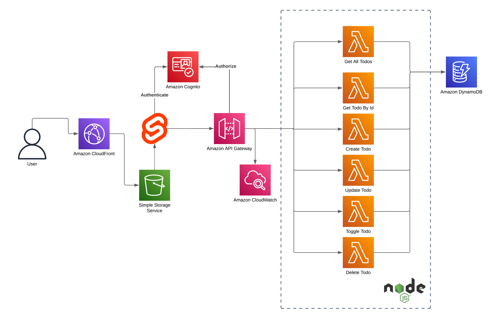
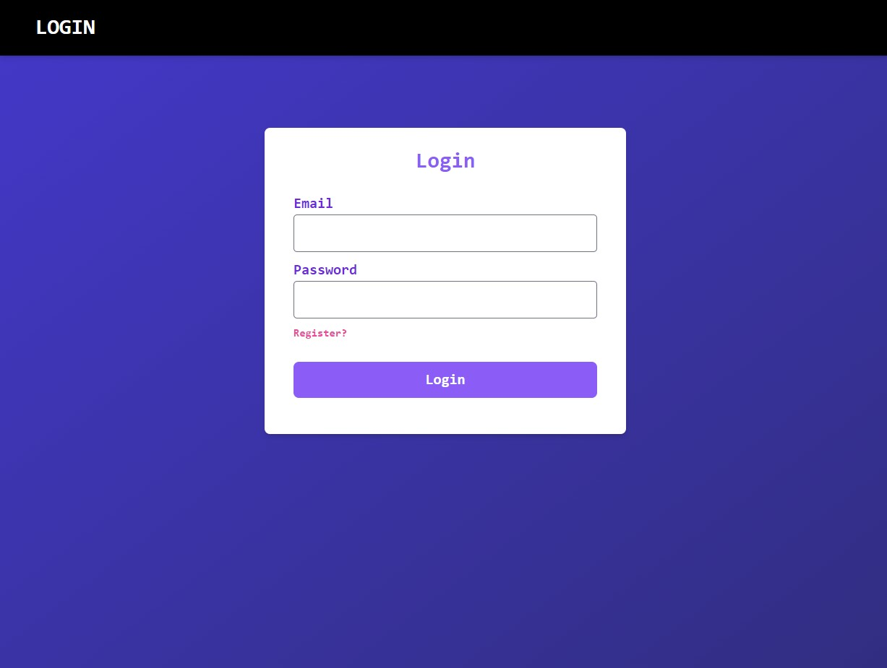
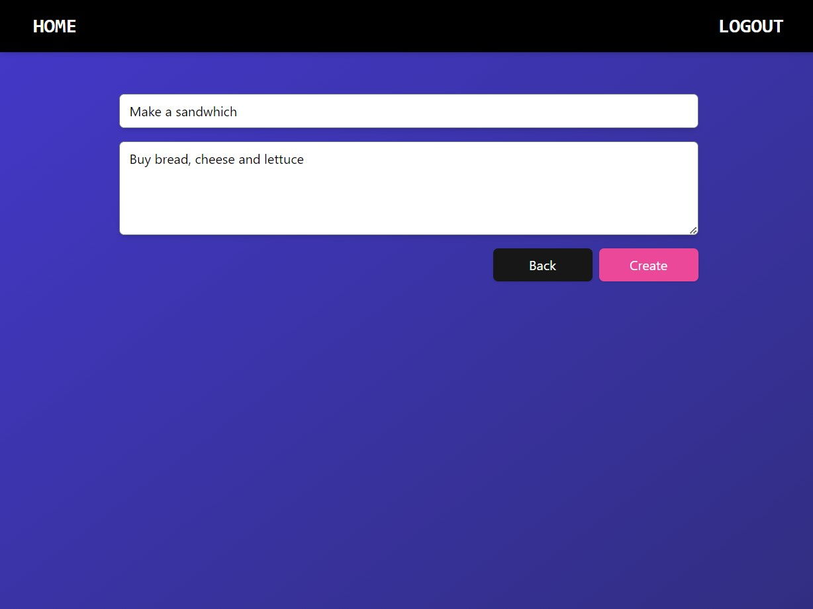
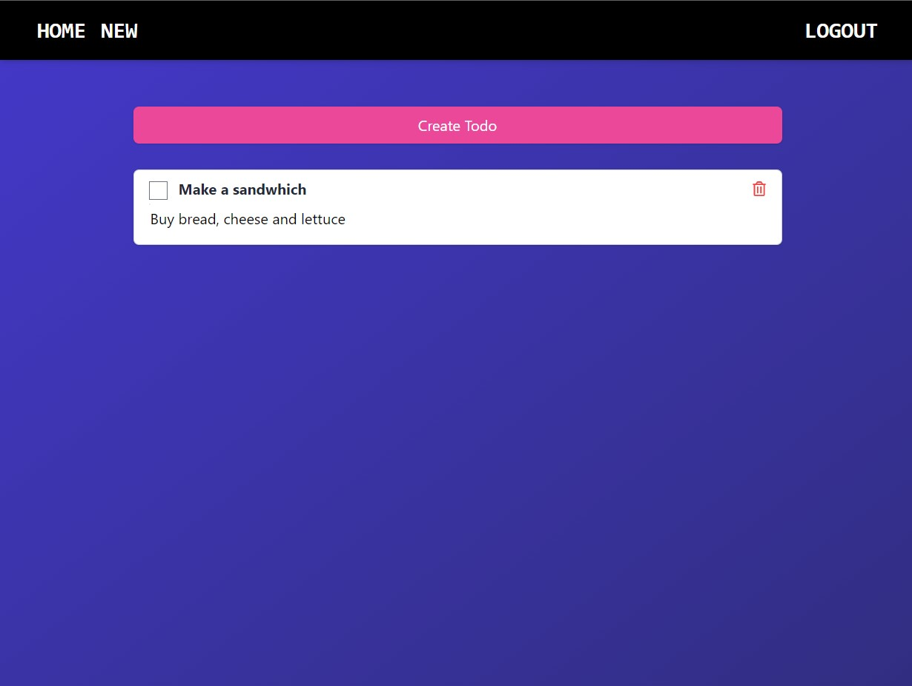

# Todo App - Svelte + AWS

A simple crud todo app using `Svelte` and `AWS` services.

It contains the following functionality:

- CRUD operations
  - Create todo
  - Edit todo
  - Delete todo
  - List todos
- Authentication
- Authorization

It uses the following AWS services:

- AWS API Gateway
- AWS Cognito
- AWS Lambda
- AWS DynamoDB
- AWS S3
- AWS CloudFront
- AWS Cloudformation
- AWS Cloudwatch

## Diagram

## Images

